---
pdf_options:
  format: A4
  margin:
    top: "2.2cm"
    bottom: "2.5cm"
    left: "2cm"
    right: "2cm"
  displayHeaderFooter: true
  headerTemplate: '<div style="font-size:7.5px;color:#aaa;width:100%;text-align:center;padding-top:6px;letter-spacing:0.04em;">DEN GLADE SKORPE &nbsp;·&nbsp; FAGPRØVERAPPORT &nbsp;·&nbsp; MATHIAS BOLL &nbsp;·&nbsp; WEBH125-2</div>'
  footerTemplate: '<div style="font-size:7.5px;color:#aaa;width:100%;text-align:center;padding-bottom:6px;"><span class="pageNumber"></span> / <span class="totalPages"></span></div>'
css: |
  @import url("https://fonts.googleapis.com/css2?family=Inter:wght@400;500;600;700&display=swap");

  * { box-sizing: border-box; }

  body {
    font-family: "Segoe UI", "Inter", Arial, Helvetica, sans-serif;
    font-size: 10.5pt;
    line-height: 1.7;
    color: #222;
    background: #fff;
  }

  /* ── Title block ── */
  h1 {
    font-size: 28pt;
    font-weight: 700;
    color: #1a1a1a;
    letter-spacing: -0.02em;
    margin: 0 0 0.15em 0;
    padding: 0;
    border: none;
    line-height: 1.15;
  }

  /* ── Section headings ── */
  h2 {
    font-size: 13pt;
    font-weight: 700;
    color: #fff;
    background: #4A4A4A;
    padding: 6px 14px;
    border-radius: 4px;
    margin: 2.2em 0 0.7em 0;
    page-break-after: avoid;
    letter-spacing: 0.01em;
  }

  h3 {
    font-size: 11pt;
    font-weight: 600;
    color: #4A4A4A;
    margin: 1.5em 0 0.4em 0;
    padding-bottom: 3px;
    border-bottom: 1.5px solid #e8e3e0;
    page-break-after: avoid;
  }

  h4 {
    font-size: 10pt;
    font-weight: 600;
    color: #555;
    margin: 1.1em 0 0.3em 0;
    page-break-after: avoid;
    text-transform: uppercase;
    letter-spacing: 0.06em;
    font-size: 8.5pt;
  }

  /* ── Code ── */
  code {
    font-family: "Consolas", "Cascadia Code", "Courier New", monospace;
    font-size: 8.5pt;
    background: #f3f2f0;
    padding: 2px 5px;
    border-radius: 3px;
    color: #b5340c;
  }

  pre {
    background: #1e1e1e;
    color: #d4d4d4;
    border-radius: 6px;
    padding: 14px 16px;
    font-family: "Consolas", "Cascadia Code", "Courier New", monospace;
    font-size: 8pt;
    line-height: 1.55;
    white-space: pre-wrap;
    word-break: break-all;
    page-break-inside: avoid;
    margin: 0.8em 0;
  }

  pre code {
    background: none;
    color: #d4d4d4;
    padding: 0;
    border-radius: 0;
    font-size: inherit;
  }

  /* ── Tables ── */
  table {
    width: 100%;
    border-collapse: collapse;
    margin: 0.9em 0 1.2em 0;
    font-size: 9.5pt;
    page-break-inside: avoid;
    border: 1px solid #ddd;
    border-radius: 4px;
    overflow: hidden;
  }

  thead tr {
    background: #4A4A4A;
  }

  th {
    color: #fff;
    padding: 8px 13px;
    text-align: left;
    font-weight: 600;
    font-size: 9pt;
    letter-spacing: 0.02em;
  }

  td {
    padding: 6px 13px;
    border-bottom: 1px solid #ece9e6;
    vertical-align: top;
    color: #333;
  }

  tr:last-child td { border-bottom: none; }
  tr:nth-child(even) td { background: #faf8f7; }

  /* ── Links ── */
  a {
    color: #4A4A4A;
    text-decoration: underline;
    word-break: break-all;
  }

  /* ── Horizontal rules ── */
  hr {
    border: none;
    border-top: 1px solid #e0dbd8;
    margin: 1.8em 0;
  }

  /* ── Lists ── */
  ul, ol {
    padding-left: 1.5em;
    margin: 0.4em 0 0.8em 0;
  }

  li { margin-bottom: 0.25em; }

  /* ── Bold / inline ── */
  strong { font-weight: 600; color: #111; }
  em { color: #555; }

  /* ── Blockquote ── */
  blockquote {
    border-left: 3px solid #c8c0bb;
    margin: 0 0 1em 0;
    padding: 6px 14px;
    color: #666;
    background: #faf8f7;
    border-radius: 0 4px 4px 0;
  }

  /* ── Figures / screenshots ── */
  figure {
    margin: 0;
    page-break-inside: avoid;
    background: #f8f6f4;
    border: 1px solid #e0dbd8;
    border-radius: 6px;
    overflow: hidden;
  }

  figure img {
    display: block;
    width: 100%;
  }

  figcaption {
    font-size: 8pt;
    color: #666;
    text-align: center;
    padding: 5px 8px 7px;
    background: #f0ece9;
    letter-spacing: 0.01em;
  }

  /* ── Section label above content ── */
  .section-intro {
    background: #faf8f6;
    border-left: 3px solid #4A4A4A;
    padding: 8px 14px;
    margin-bottom: 1em;
    border-radius: 0 4px 4px 0;
    font-size: 9.5pt;
    color: #555;
  }
---

# Den Glade Skorpe — Fagprøverapport

---

**Opgavenavn:** Den Glade Skorpe  
**Navn:** Mathias Boll  
**Hold:** WebH125-2  
**Skole:** Media College Denmark  
**Afleveringsdato:** 26-06-2026  
**Fremlæggelse:** Uge 32–35 (3. aug – 30. aug 2026)

---

## Erklæring

Jeg bekræfter hermed, at denne opgave er udarbejdet af mig selv, og at jeg ikke har afleveret den eller dele af den til vurdering ved andre eksaminer. Jeg har angivet alle anvendte kilder og hjælpemidler, herunder AI-assisterede værktøjer.

*Mathias Boll — 26-06-2026*

---

## Indholdsfortegnelse

1. [Vurdering af egen indsats](#1-vurdering-af-egen-indsats)
2. [Tidsplan og proces](#2-tidsplan-og-proces)
3. [Tech stack](#3-tech-stack)
4. [Faglige valg og dokumentation](#4-faglige-valg-og-dokumentation)
5. [Designbeslutninger og afvigelser fra Figma](#5-designbeslutninger-og-afvigelser-fra-figma)
6. [Tilvalgsopgaver](#6-tilvalgsopgaver)
7. [Anvendelse af tredjepart og AI](#7-anvendelse-af-tredjepart-og-ai)
8. [Testoplysninger](#8-testoplysninger)
9. [Særlige punkter til bedømmelse](#9-særlige-punkter-til-bedømmelse)
10. [Bilag](#10-bilag)

---

## 1. Vurdering af egen indsats

### Hvad gik godt

Jeg er overordnet tilfreds med resultatet. Det lykkedes mig at bygge en komplet, mobilvenlig webapplikation med et sammenhængende brugerflow fra forside til afgivet ordre. Alle obligatoriske krav er implementeret, og jeg nåede at gennemføre samtlige 7 tilvalgsopgaver — også authentication og POST af ordrer til serveren.

Det, jeg er mest stolt af, er den røde tråd i brugeroplevelsen: en bruger kan gå fra forsiden, vælge en ret, tilpasse ingredienserne, vælge størrelse, lægge den i kurven og afgive en ordre — alt i én sammenhængende, intuitiv rækkefølge uden tekniske fejl.

Komponentstrukturen er overskuelig og genbrugelig. `DishCard` bruges på forsiden, CSS Modules holder styling-scope rent pr. komponent, og `BasketContext` fungerer pålideligt som global tilstandsstyring med localStorage-persistens.

Responsiviteten fungerer godt i alle testede skærmstørrelser — fra 320px (lille Android) til 2560px (ultrawide monitor) — og mobiludgaven er tydeligt prioriteret som primær platform.

### Hvad var udfordrende

**MongoDB-felter og API-envelope:** Serveren returnerede data i formatet `{ status, message, data: [...] }`. Jeg opdagede undervejs, at visse endpoints returnerede direkte arrays mens andre brugte `.data`-wrapperen. Det krævede grundig gennemlæsning af routekoden og systematisk test i Postman for at afstemme.

**FormData til billedupload:** Backoffice medarbejder- og retteopret bruger `multipart/form-data` fordi der skal uploades billeder. `fetch` skal have `Content-Type` udeladt — browseren sætter den automatisk med korrekt boundary. Det er ikke intuitivt og kostede fejlretning.

**JWT-auth-flow:** Selvom auth er valgfrit, valgte jeg at implementere det. Det kræver at tokenet gemmes korrekt i `localStorage`, sendes som `Authorization: Bearer <token>` header på beskyttede endpoints, og at frontend håndterer 401-svar ved at logge ud og sende brugeren til login.

**Hero-højde på mobil:** Det originale Figma-design har en hero der fylder `100svh` på alle enheder. På mobil betød det at brugeren ikke kunne se indhold "above the fold". Jeg reducerede til 55svh (mobil), 65svh (tablet), 100svh (desktop) — se [afsnit 5](#5-designbeslutninger-og-afvigelser-fra-figma).

### Hvad ville jeg gøre anderledes

Jeg ville kortlægge alle API-endpointernes eksakte responsformat (wrapped/ikke-wrapped) i en tabel inden integrationen begyndte. Det ville have sparet fejlretningstid.

Jeg ville også gennemgå Figma-designet for alle sider systematisk fra start — inklusive backoffice-frames — frem for én side ad gangen.

### Faglig udvikling

Projektet har givet mig solid erfaring med:
- End-to-end React-applikationsarkitektur (kontekst, routing, service-lag)
- Arbejde mod et rigtigt REST API med auth og filupload
- Mobile-first CSS med CSS Modules og custom design tokens
- Git-disciplin: hyppige, beskrivende commits og GitHub Issues som projektstyringsværktøj

---

## 2. Tidsplan og proces

Projektet er styret via **GitHub Issues** og **GitHub Projects** (Kanban-board). Alle opgaver er oprettet som issues med labels, estimater og beskrivelser inden arbejdet begyndte.

GitHub repository: https://github.com/MathiasBoll/Opgave---Den-Glade-Skorpe

### Dagsoversigt

| Dag | Aktiviteter | Tid |
|-----|------------|-----|
| Dag 1 — Planlægning | Gennemlæsning af kravspec, Figma-studium, oprettelse af GitHub Issues #1–#16 (mandatory) og #17–#20 (optional) | ~2 t |
| Dag 2 — Projektopsætning | Vite-projekt, React Router v6, CSS variables, fonts, header, footer, grundlæggende routes | ~3 t |
| Dag 3 — Forside + retteside | DishCard-komponent, kategorifilter (GET /categories), dynamisk filtrering uden reload, /dish/:id med størrelsesvælger | ~4 t |
| Dag 4 — Kurv + bestilling | BasketContext med localStorage, Basket-side, mængdekontrol, postOrder til /order, OrderConfirmation-side | ~3 t |
| Dag 5 — Personale + kontakt | Employees-side med GET /employees, ContactForm med validering og POST /message, ContactConfirmation | ~2 t |
| Dag 6 — Backoffice | BackofficeLogin, AuthContext + JWT, RequireAuth, BackofficeEmployees CRUD med billede-upload | ~4 t |
| Dag 7 — Backoffice tilvalg | BackofficeMessages, BackofficeOrders, BackofficeDishes CRUD | ~2 t |
| Dag 8 — API-fejlretning | Response-envelope mismatch, FormData-håndtering, endpoints verificeret i Postman | ~3 t |
| Dag 9 — UX-polish | 404-side, loading/error/empty states, document.title hooks, responsivt CSS (alle breakpoints) | ~2 t |
| Dag 10 — Tilvalg + rapport | Extra ingredienser (pill-chip), pizza-ikon badge, mængdekontrol i kurv, designfixes, RAPPORT.md | ~2 t |
| **Total** | | **~27 t** |

### Estimat vs. faktisk tid

Overordnet holdt estimaterne. De faser der tog længere:
- **API-fejlretning** (+1 t) — Mismatch i response-format på tværs af endpoints
- **Auth-flow** (+1 t) — JWT-headers, 401-håndtering og token-persistens krævede mere end forventet

### Projektstyringsværktøj

Alle tasks tracket som GitHub Issues — se: https://github.com/MathiasBoll/Opgave---Den-Glade-Skorpe/issues

Issues fordelt i grupper:
- **Mandatory** — #4–#16
- **Optional** — #17–#20
- **Fixes/polish** — #24–#41

---

## 3. Tech stack

| Teknologi | Rolle | Begrundelse |
|-----------|-------|-------------|
| **React 18** | UI-framework | Komponent-baseret arkitektur matcher kravene om genanvendelige komponenter. Hooks giver ren tilstandsstyring. |
| **Vite** | Bundler og dev-server | Hurtig HMR vs. CRA. Officielt anbefalet til nye React-projekter. |
| **React Router v6** | Klient-routing | Deklarativ routing. `RequireAuth`-wrapper beskytter backoffice-routes. `useNavigate` og `useParams` bruges i flow. |
| **CSS Modules** | Scoped styling | Automatisk navne-scoping forhindrer stilklasser i at lække på tværs af komponenter. Ren CSS — ingen ekstra dependency. |
| **@fontsource** | Lokale fonts | Just Another Hand og Kurale indlæses lokalt. Ingen Google Fonts CDN-request — hurtigere og ingen GDPR-problematik. |
| **Node.js + Express** | Backend API | Udleveret — bruges som-is |
| **MongoDB + Mongoose** | Database | Udleveret — fleksibelt dokumentschema |
| **Multer** | Billedupload | Udleveret — håndterer multipart/form-data |
| **bcryptjs** | Password-hashing | Udleveret |
| **JSON Web Tokens** | Auth | Udleveret — stateless JWT gemt i localStorage, sendt som Bearer-header |
| **Postman** | API-testning | Verificering af alle endpoints manuelt inden frontend-integration |

### Valg: CSS Modules frem for Tailwind/Sass

Opgavebeskrivelsen kræver "overskuelig mappestruktur og læsbar kode". CSS Modules opfylder dette: styling er samlokaliseret med komponenten i en `.module.css`-fil, klasserne er scoped automatisk, og der er ingen build-overhead. Sass ville give nesting men ingen scope-fordel. Tailwind ville gøre JSX sværere at læse ved en mundtlig gennemgang.

---

## 4. Faglige valg og dokumentation

### 4.1 Mappestruktur og komponentarkitektur

```
dgs_frontend/src/
├── components/       ← Delte: Header, Footer, DishCard, RequireAuth
├── context/          ← Global tilstand: BasketContext, AuthContext
├── hooks/            ← Custom hooks: usePageTitle
├── pages/            ← Én fil pr. route
│   ├── Home.jsx + Home.module.css
│   ├── DishDetail.jsx + DishDetail.module.css
│   ├── Employees.jsx + Employees.module.css
│   ├── Contact.jsx + Contact.module.css
│   ├── Basket.jsx + Basket.module.css
│   └── backoffice/
│       ├── Backoffice.jsx          ← Shell med sidebar-nav
│       ├── BackofficeEmployees.jsx
│       ├── BackofficeMessages.jsx
│       ├── BackofficeOrders.jsx
│       └── BackofficeDishes.jsx
├── services/
│   └── api.js        ← Centralt API-lag (alle fetch-kald)
└── styles/
    ├── variables.css ← CSS custom properties
    └── global.css    ← Reset og body-styles
```

`services/api.js` er det eneste sted der laves `fetch`-kald. Ændres API-URL'en, ændres den kun ét sted.

### 4.2 Design tokens (CSS custom properties)

```css
:root {
  --color-dark:    #4A4A4A;  /* header, footer, knapper */
  --color-cream:   #F6F0EE;  /* sektion- og kortbaggrunde */
  --color-white:   #ffffff;
  --font-heading:  'Just Another Hand', cursive;
  --font-body:     'Kurale', serif;
  --max-width:     1200px;
  --border-radius: 8px;
  --spacing-xs:    0.5rem;
  --spacing-sm:    1rem;
  --spacing-md:    1.5rem;
  --spacing-lg:    2rem;
  --spacing-xl:    3rem;
}
```

Ændres `--color-dark` opdateres samtlige knapper, header, footer og ingrediens-pills automatisk.

### 4.3 Mobile-first og breakpoints

| Breakpoint | Target |
|-----------|--------|
| Standard (ingen query) | 375px smartphones |
| `max-width: 374px` | 320px (gamle iPhones) |
| `min-width: 768px` | Tablets |
| `min-width: 1024px` | Laptop/desktop |
| `min-width: 1440px` | Store skærme |
| `min-width: 2560px` | Ultrawide/4K |

Eksempel — Forside grid skalerer fra 2–3 kolonner (mobil) til 6 kolonner (ultrawide) udelukkende via CSS.

### 4.4 Kurv med localStorage og React Context

`BasketContext` giver Header, DishDetail og Basket adgang til samme kurvtilstand uden prop-drilling.

Nøglebeslutninger:
- `basketKey = "${_id}-${selectedSize}"` — Normal og Familie af samme ret er separate kurvelinjer
- localStorage under nøglen `dgs_basket` — kurven overlever sidereloads
- `updateQuantity(key, 0)` kalder automatisk `removeItem` — ingen ekstra logik ved 0
- `count` (sum af quantity) drives kurv-badge i Header

```js
function addItem(dish) {
  setItems((prev) => {
    const existing = prev.find((i) => i.basketKey === dish.basketKey)
    if (existing) {
      return prev.map((i) =>
        i.basketKey === dish.basketKey ? { ...i, quantity: i.quantity + 1 } : i
      )
    }
    return [...prev, { ...dish, quantity: 1 }]
  })
}
```

### 4.5 Centralt API-lag (services/api.js)

```js
const BASE_URL = import.meta.env.VITE_API_BASE_URL || 'http://localhost:3042'

async function request(path, options = {}) {
  const res = await fetch(`${BASE_URL}${path}`, options)
  if (!res.ok) throw new Error(`HTTP ${res.status}`)
  return res.json()
}

export const getDishes      = () => request('/dishes').then((r) => r.data)
export const getDish        = (id) => request(`/dish/${id}`).then((r) => r.data)
export const getEmployees   = () => request('/employees').then((r) => r.data)
export const getIngredients = () => request('/ingredients').then((r) => r.data)
export const postOrder      = (body) => request('/order', {
  method: 'POST',
  headers: { 'Content-Type': 'application/json' },
  body: JSON.stringify(body),
})
```

### 4.6 Authentication (backoffice)

Alle `/backoffice`-routes er pakket i `RequireAuth`:

```jsx
<Route path="/backoffice" element={<RequireAuth><Backoffice /></RequireAuth>}>
  <Route index element={<BackofficeEmployees />} />
  <Route path="employees" element={<BackofficeEmployees />} />
  <Route path="messages" element={<BackofficeMessages />} />
  <Route path="orders" element={<BackofficeOrders />} />
  <Route path="dishes" element={<BackofficeDishes />} />
</Route>
```

Flow: Login → `POST /auth/signin` → JWT-token → gemmes i localStorage → redirect til `/backoffice`. `USE_JWT=false` i `.env.local` deaktiverer krav under udvikling.

### 4.7 Loading-, error- og empty states

Alle sider med API-kald implementerer tre tilstande konsekvent:

```jsx
if (loading) return <main><p className={styles.status}>Henter retter…</p></main>
if (error)   return <main><p className={styles.status}>Noget gik galt: {error}</p></main>
if (items.length === 0) return <p className={styles.empty}>Ingen retter fundet.</p>
```

### 4.8 SEO og tilgængelighed

- `usePageTitle(title)` — custom hook sætter `document.title` dynamisk på alle sider
- Semantisk HTML — `<main>`, `<header>`, `<nav>`, `<footer>`, `<section>`, `<ul>`, `<li>`
- `aria-label` på burger-knap og luk-knap i mobilmenuen
- `alt`-tekst på alle billeder
- Kontrast — hvid tekst på `#4A4A4A` giver tilstrækkelig ratio
- `overflow-x: hidden` på `html` og `body` forhindrer vandret scroll på mobil

---

## 5. Designbeslutninger og afvigelser fra Figma

Designet er fulgt så tæt som muligt. Alle afvigelser er begrundede med forbedret brugeroplevelse, tilgængelighed eller funktionalitet — som tilladt i opgavebeskrivelsen.

### 5.1 Hero-højde på mobil (DishDetail)

**Figma:** Hero fylder `100svh` på alle enheder.

**Implementeret:** 55svh (telefon) · 65svh (tablet) · 100svh (desktop).

**Begrundelse:** En fuld-skærms hero på mobil skjuler alt indhold "below the fold" — brugeren ser hverken ingredienser, størrelsesvælger eller "Tilføj til kurv" knap uden at scrolle. 55svh signalerer det visuelle udtryk og lader brugeren se at der er mere at scrolle til.

```css
.hero { min-height: 55svh; }
@media (min-width: 768px)  { .hero { min-height: 65svh; } }
@media (min-width: 1024px) { .hero { min-height: 100svh; } }
```

*(Screenshot: `docs/screenshots/dish-detail-mobile.png`)*

### 5.2 Ingredient-toggle: pill-chip grid frem for simpel liste

**Figma:** Ingredienspanelet viser en lodret liste med check-bokse.

**Implementeret:** Flex-wrap pill-chip grid. Tre visuelle tilstande:
- Mørk udfyldt pill (✓) — ingrediens er valgt
- Outlined med gennemstregning — basisingrediens fravalgt
- Outlined normal — ekstra ingrediens klar til at tilføjes

**Begrundelse:** 29 ingredienser i en lodret liste er svær at scanne. Pill-grid er kompakt og giver hurtig visuel feedback. Implementeringen er mere ambitiøs end Figma-eksemplet: vi henter **alle 29 ingredienser fra serveren** (`GET /ingredients`) med `Promise.all`, så brugeren kan tilføje noget der ikke er på pizzaen i forvejen — ikke kun fjerne basisingredienser.

*(Screenshot: `docs/screenshots/dish-detail-extras-open.png`)*

### 5.3 Kurv: mængdekontrol (−/antal/+)

**Figma:** Kurvsiden viser kun navn, pris og "Fjern"-knap.

**Implementeret:** `[−] [antal] [+]  Fjern` pr. kurvelinje.

**Begrundelse:** Standard UX i alle webshops. Opgavebeskrivelsen kræver "intuitiv interaktion og tydelig feedback" — mængdekontrol opfylder begge uden at brugeren skal tilbage til menuen.

*(Screenshot: `docs/screenshots/basket-mobile.png`)*

### 5.4 Kurv-badge: pizza-ikon frem for tekst

**Figma:** "Kurv" som tekstlink med tal-badge.

**Implementeret:** Logo-billedet (`logo.png`) som cirkulær pizza-ikon med count-badge overlay.

**Begrundelse:** Et ikon kommunikerer formålet hurtigere end tekst, bruger mindre plads i nav-baren, og er konsistent med pizzeriaets brand-visual.

*(Screenshot: `docs/screenshots/design-pizza-badge.png`)*

### 5.5 Bekræftelsessider: fuld-skærms pizza-baggrund

**Figma:** Hvide kort-modaler ved order/kontakt-bekræftelse.

**Implementeret:** Dedikerede sider (`/order-confirmation`, `/contact/tak`) med pizza-headerbilledet som fuld-skærms baggrund og hvid tekst.

**Begrundelse:** En dedikeret route er mere stabil end en modal (ingen scroll-position-problemer), og den visuelle "brand moment" med pizza-baggrunden matcher sitedesignet bedre end et hvidt kort.

*(Screenshot: `docs/screenshots/order-confirmation.png`)*

---

## 6. Tilvalgsopgaver

Alle 7 tilvalgsopgaver er implementeret (minimum 1 krævet).

| Nr. | Tilvalg | Status | Detaljer |
|----|---------|--------|---------|
| 1 | Responsivt desktop-layout (>1024px) | ✅ | Breakpoints ved 768/1024/1440/2560px. Grid: 3-kol mobil → 6-kol ultrawide. |
| 2 | Extra ingredienser på retteside | ✅ | Promise.all henter dish + alle 29 ingredienser parallelt. Pill-chip grid, 3 tilstande, selectedExtras gemmes i kurv. |
| 3 | Backoffice: Retter CRUD | ✅ | Opret/rediger/slet med billede-upload via FormData. Kategori og ingredienser kan sættes. |
| 4 | Backoffice: Beskeder | ✅ | Viser alle beskeder fra kontaktformularen, sletning understøttes. |
| 5 | Backoffice: Ordrer | ✅ | Viser alle indkomne ordrer med detaljer. |
| 6 | Afgiv ordre via serveren (POST) | ✅ | Kurv sender POST /order med retter, størrelser og total. Kurv tømmes → redirect til /order-confirmation. |
| 7 | Authentication — backoffice login | ✅ | JWT via POST /auth/signin. Token i localStorage. RequireAuth beskytter alle /backoffice-routes. 401 logger ud automatisk. |

### Uddybning: Extra ingredienser (tilvalg 2)

```jsx
// DishDetail.jsx — henter dish og ingredienser parallelt
useEffect(() => {
  Promise.all([getDish(id), getIngredients()])
    .then(([data, ingData]) => {
      setDish(data)
      const baseNames = data.ingredients?.map((i) =>
        typeof i === 'string' ? i : i.name) ?? []
      setSelectedExtras(baseNames)           // basisingredienset pre-checked
      const allNames = (ingData ?? []).map((i) =>
        typeof i === 'string' ? i : i.name)
      setAllIngredients(allNames)            // alle 29 tilgængelige
    })
    .catch((err) => setError(err.message))
    .finally(() => setLoading(false))
}, [id])
```

### Uddybning: Authentication (tilvalg 7)

`USE_JWT=true` aktiverer fuld JWT-beskyttelse på serveren. Frontend sender altid `Authorization: Bearer <token>` — serveren ignorerer det bare når JWT er slået fra. Det betyder at koden fungerer identisk uanset serverindstilling.

---

## 7. Anvendelse af tredjepart og AI

### Tredjepartsbiblioteker

| Pakke | Formål |
|-------|--------|
| `react` + `react-dom` | UI-framework |
| `react-router-dom` | Klient-sidenavigation |
| `@fontsource/just-another-hand` | Lokal font — overskrifter |
| `@fontsource/kurale` | Lokal font — brødtekst |
| `vite` + `@vitejs/plugin-react` | Build-tool og dev-server |

Alle øvrige afhængigheder (Express, Mongoose, Multer, bcryptjs, jsonwebtoken) er del af det udleverede backend-projekt og er ikke tilføjet af mig.

### AI-assisterede værktøjer

Jeg har anvendt **GitHub Copilot** (Claude Sonnet 4.6) som kodningsassistent i VS Code under hele projektet.

**Hvad Copilot hjalp med:**
- At skrive og fejlfinde React-komponenter og CSS-moduler
- At forstå Express-routes og MongoDB-modellernes forventede feltnavne
- At opdage mismatch mellem frontend-requests og backend-forventninger (fx response-envelope)
- At strukturere GitHub Issues, tidsplan og projektdokumentation
- At designe pill-chip ingredient-toggles og mængdekontrol i kurven

**Hvad jeg selv besluttede og kan forklare:**
- Alle arkitekturvalg (komponentopdeling, context vs. props, routestruktur)
- Alle designafvigelser fra Figma og begrundelserne for dem
- Valget af CSS Modules frem for Tailwind/Sass
- `basketKey`-strategien for størrelsesopdeling i kurven
- `Promise.all`-mønsteret til parallel datahentning i DishDetail
- At hente alle ingredienser fra serveren frem for at hårdkode dem

Al kode er gennemlæst og godkendt af mig. Jeg er bevidst om indholdet af hvert eneste fil og kan redegøre for dem mundtligt.

---

## 8. Testoplysninger

| Type | Oplysning |
|------|-----------|
| Frontend URL | http://localhost:5174 |
| Backend URL | http://localhost:3042 |
| Admin login | admin@mediacollege.dk / admin |
| Guest login | guest@mediacollege.dk / guest |
| MongoDB database | mcd-dengladeskorpe |
| USE_JWT | false (login valgfrit — sæt true for at aktivere) |

**Start backend:**
```bash
cd mcd_web_dengladeskorpe_server
npm install
npm run "Opret Database"
npm run "Start Server"
```

**Start frontend:**
```bash
cd dgs_frontend
npm install
npm run dev
```

---

## 9. Særlige punkter til bedømmelse

### 1. Komplet bestillingsflow

Bruger kan gennemføre et fuldt bestillingsforløb: vælge ret → tilpasse ingredienser → vælge størrelse → lægge i kurv → justere antal → afgive ordre → se bekræftelse. Alt fungerer i én sammenhængende brugerrejse uden fejl.

### 2. Backoffice employees CRUD med billede-upload

Komplet opret/rediger/slet med billede-upload via FormData. Bekræftelsesdialog ved sletning. Live opdatering af tabel efter hver operation.

### 3. Backoffice dishes CRUD

Retter kan oprettes med titel, priser (normal + familie), ingredienser og kategori. Billede-upload understøttes. Eksisterende retter kan redigeres og slettes.

### 4. Extra ingredienser med serverkald

Alle 29 tilgængelige ingredienser hentes fra serveren — ikke hårdkodet. Brugeren kan tilføje hvad som helst til pizzaen, ikke kun fjerne basisingredienser. Valgte ingredienser vises i kurven under "Ekstra:".

### 5. Responsivt layout — 7 breakpoints

Layout skalerer fra 320px (ultrasmalle telefoner) til 2560px (ultrawide). Hvert breakpoint er testet og har meningsfulde layoutændringer (antal kolonner, fontstørrelser, hero-højder).

### 6. Mobile-first implementering

Alle sider er designet mobile-first. Burger-menu, fluid grids og kompakte layouts er udgangspunktet — desktop er en progressiv forbedring.

### 7. Fejlhåndtering og loading-tilstande

Alle API-kald har loading-indikatorer, fejlbeskeder og tomme-tilstande. Ingen side viser en blank skærm under indlæsning eller ved fejl.

---

## 10. Bilag

### 10.1 Skærmbilleder

Alle screenshots er taget automatisk med Playwright / headless Chromium.
Mobil: 390 × 844 px · DeviceScaleFactor 2 (svarende til iPhone 14 Pro).
Desktop: 1440 × 900 px · viewport-snapshot.

---

#### Forside — Mobil (390 px)

<div style="display:grid;grid-template-columns:1fr 1fr 1fr;gap:10px;margin:12px 0;">

<figure>
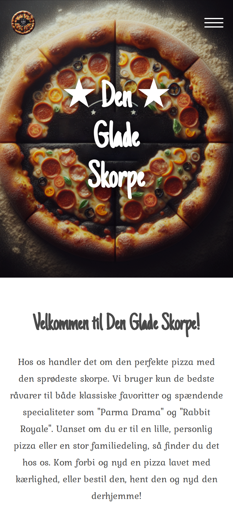
<figcaption>Forside – hero &amp; navigation</figcaption>
</figure>

<figure>
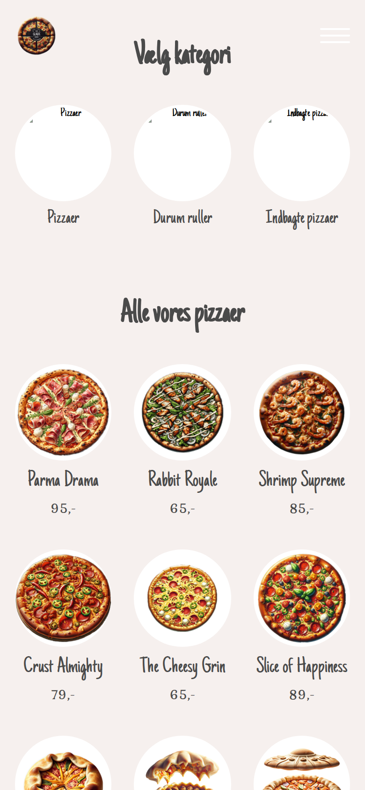
<figcaption>Forside – kategorifilter</figcaption>
</figure>

<figure>
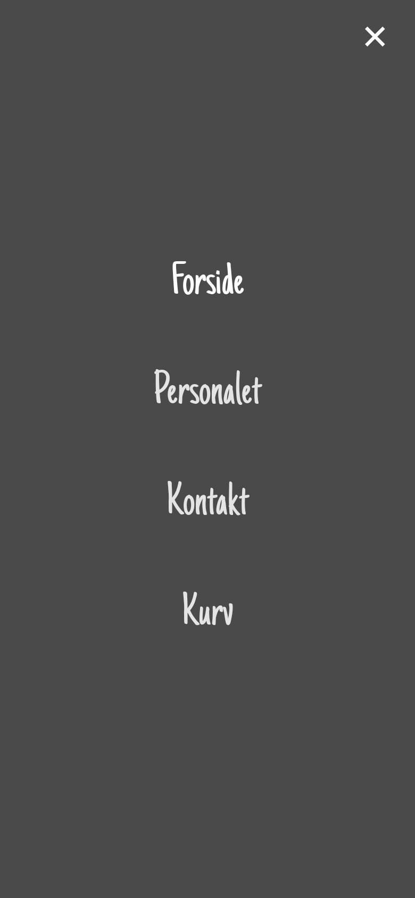
<figcaption>Burger-menu åben</figcaption>
</figure>

</div>

---

#### Retteside — Mobil

<div style="display:grid;grid-template-columns:1fr 1fr;gap:12px;margin:12px 0;">

<figure>
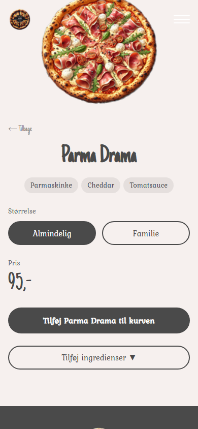
<figcaption>Retteside – størrelsesvælger &amp; tilføj til kurv</figcaption>
</figure>

<figure>
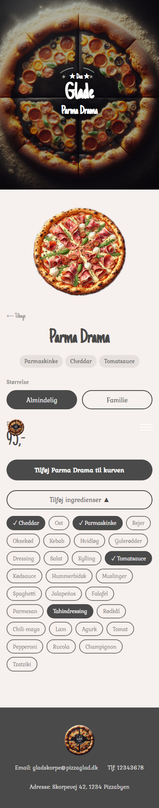
<figcaption>Retteside – ingredienspanel åbent (alle 29 ingredienser)</figcaption>
</figure>

</div>

---

#### Kurv og Bestilling — Mobil

<div style="display:grid;grid-template-columns:1fr 1fr;gap:12px;margin:12px 0;">

<figure>
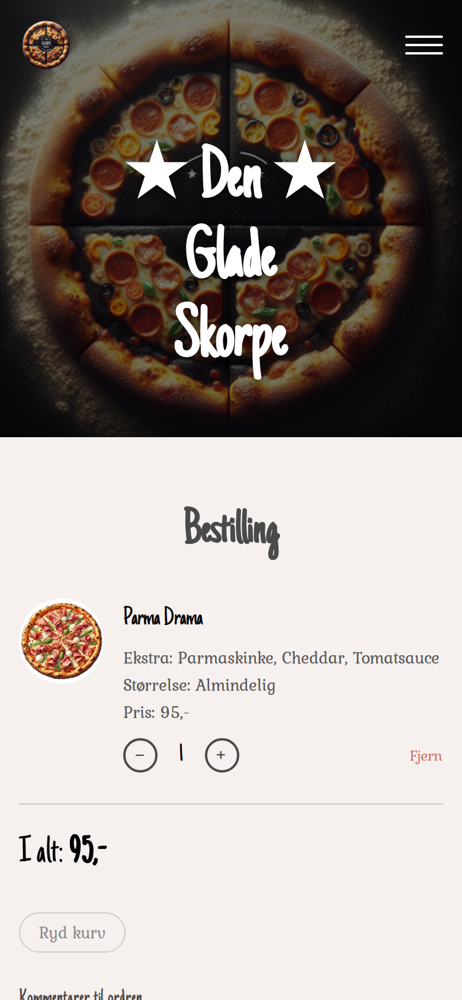
<figcaption>Kurv – mængdekontrol, extras og afgiv ordre</figcaption>
</figure>

<figure>
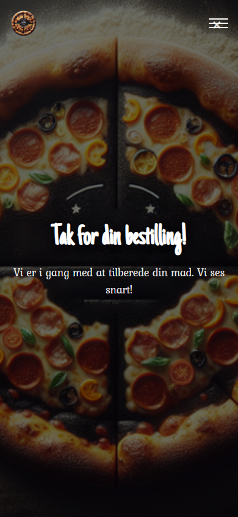
<figcaption>Ordrebekræftelse</figcaption>
</figure>

</div>

---

#### Øvrige sider — Mobil

<div style="display:grid;grid-template-columns:1fr 1fr 1fr;gap:10px;margin:12px 0;">

<figure>
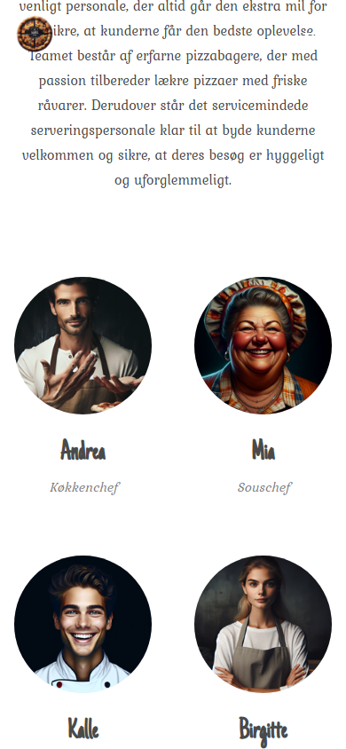
<figcaption>Personaleside</figcaption>
</figure>

<figure>
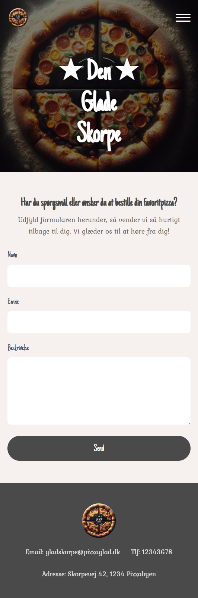
<figcaption>Kontaktformular</figcaption>
</figure>

<figure>
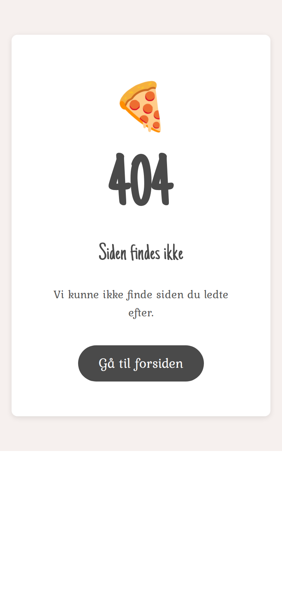
<figcaption>404 – Siden findes ikke</figcaption>
</figure>

</div>

---

#### Forside og Retter — Desktop (1440 px)

<div style="display:grid;grid-template-columns:1fr;gap:12px;margin:12px 0;">

<figure>
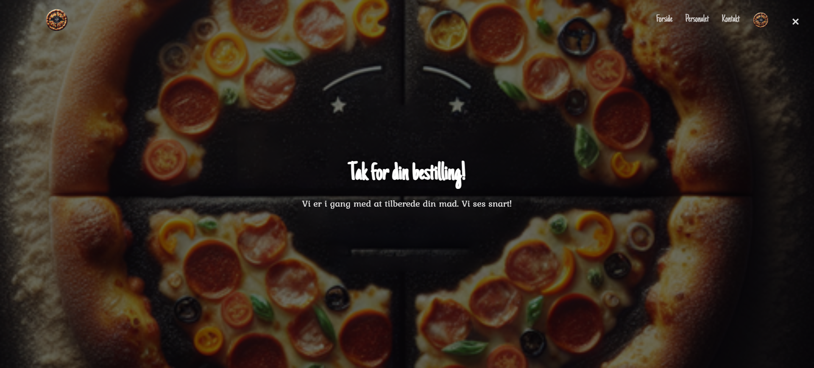
<figcaption>Forside – hero og navigation (desktop 1440 px)</figcaption>
</figure>

<figure>
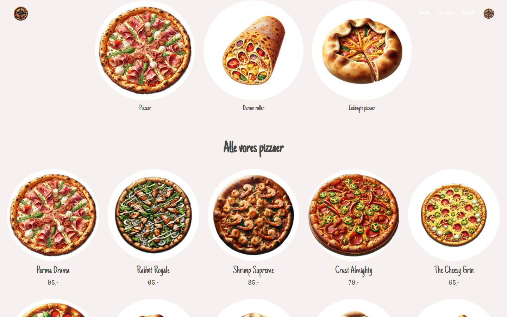
<figcaption>Forside – rettegrid og kategorifilter (desktop)</figcaption>
</figure>

</div>

<div style="display:grid;grid-template-columns:1fr 1fr;gap:12px;margin:12px 0;">

<figure>
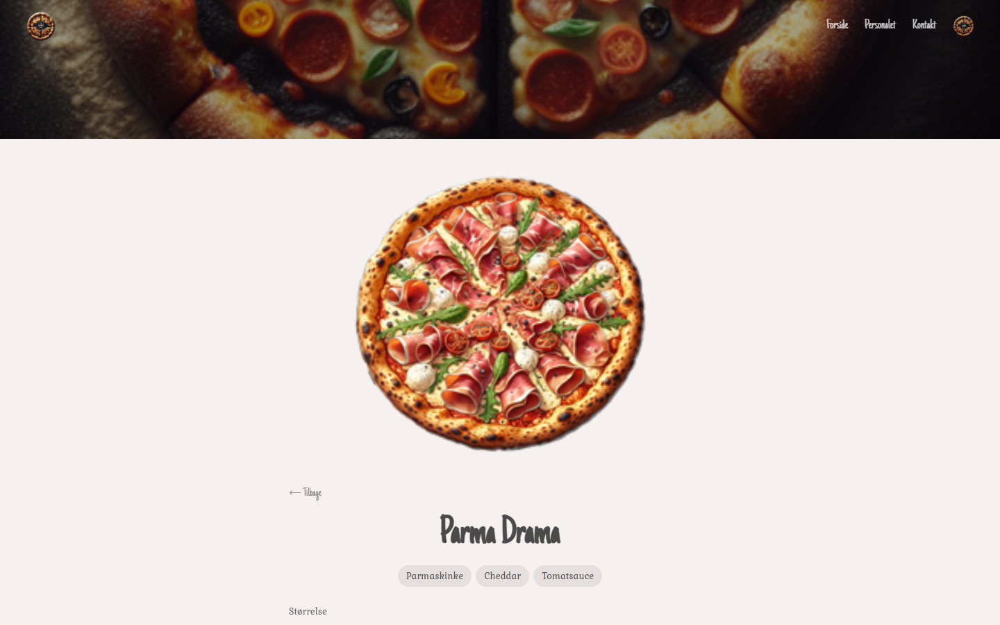
<figcaption>Retteside (desktop)</figcaption>
</figure>

<figure>
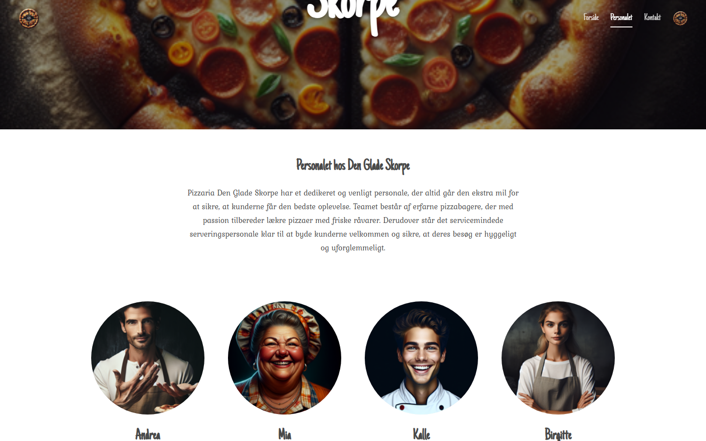
<figcaption>Personaleside (desktop)</figcaption>
</figure>

</div>

---

#### Backoffice — Desktop

<div style="display:grid;grid-template-columns:1fr 1fr;gap:12px;margin:12px 0;">

<figure>
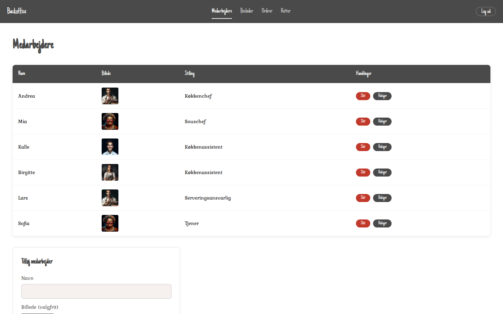
<figcaption>Backoffice – Medarbejdere CRUD &amp; billede-upload</figcaption>
</figure>

<figure>
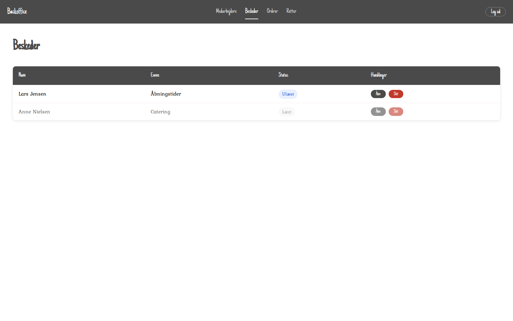
<figcaption>Backoffice – Beskeder fra kontaktformular</figcaption>
</figure>

<figure>
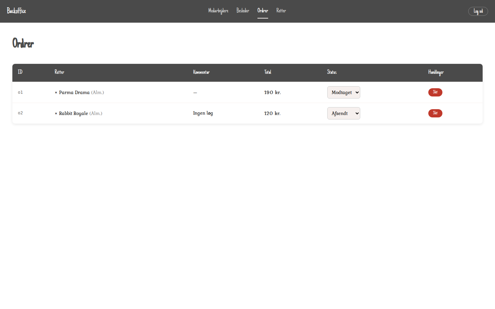
<figcaption>Backoffice – Indkomne ordrer</figcaption>
</figure>

<figure>
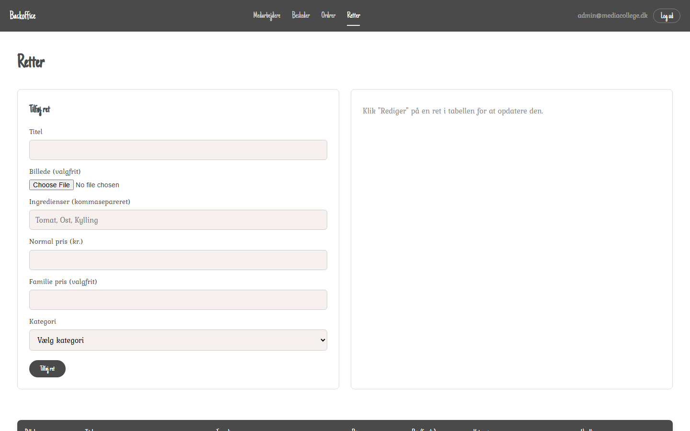
<figcaption>Backoffice – Retter CRUD</figcaption>
</figure>

</div>

---

### 10.2 Links

| Ressource | URL |
|-----------|-----|
| GitHub repository | https://github.com/MathiasBoll/Opgave---Den-Glade-Skorpe |
| Figma design | https://www.figma.com/design/yzjuDfwFzngz8EySrOXSf6/Den-Glade-Skorpe |
| GitHub Issues | https://github.com/MathiasBoll/Opgave---Den-Glade-Skorpe/issues |

### 10.3 Opgavebeskrivelse

`mcd_web_dengladeskorpe_server/[mcd]/assignment/den_glade_skorpe.md`
